# club-QuickBox

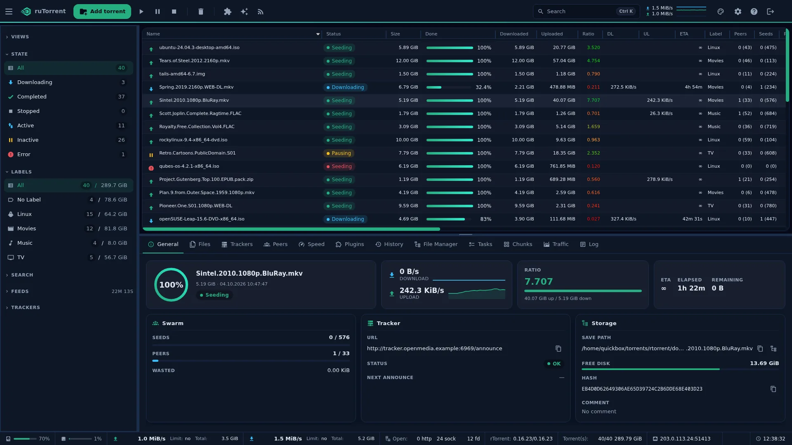

club-QuickBox is a modern skin for ruTorrent, the web UI for rTorrent. It is the default ruTorrent theme on every QuickBox Pro install, and it is free to use anywhere ruTorrent runs.

The skin reskins every surface of ruTorrent, the top bar and sidebar, the torrent table and details drawer, every dialog and the Settings pages, so the whole client reads as one design system that mirrors the QuickBox dashboard.

## Variants

club-QuickBox ships four color variants plus an Auto mode:

| Variant | Look |
|---------|------|
| **Spectre** | Deep navy with a teal-to-green accent. The default. |
| **Smoked** | Dark slate with a blue accent. |
| **Reel** | Warm charcoal with an amber accent. |
| **Light** | Near-white with a blue accent. |
| **Auto** | Follows your QuickBox dashboard theme and switches with it. |

Pick a variant from the appearance selector in Settings, beside the stock theme list. In Auto mode the skin reads the dashboard theme and re-checks it when the tab regains focus, so changing your theme in the dashboard is followed here with no reload.

| Spectre | Smoked |
|---------|--------|
|  | 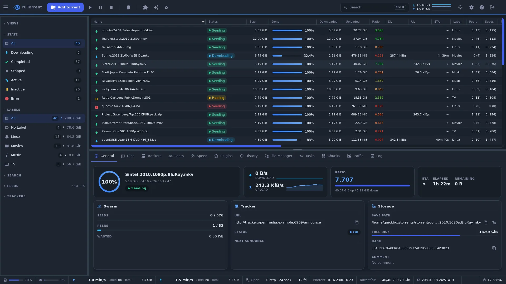 |
| **Reel** | **Light** |
| 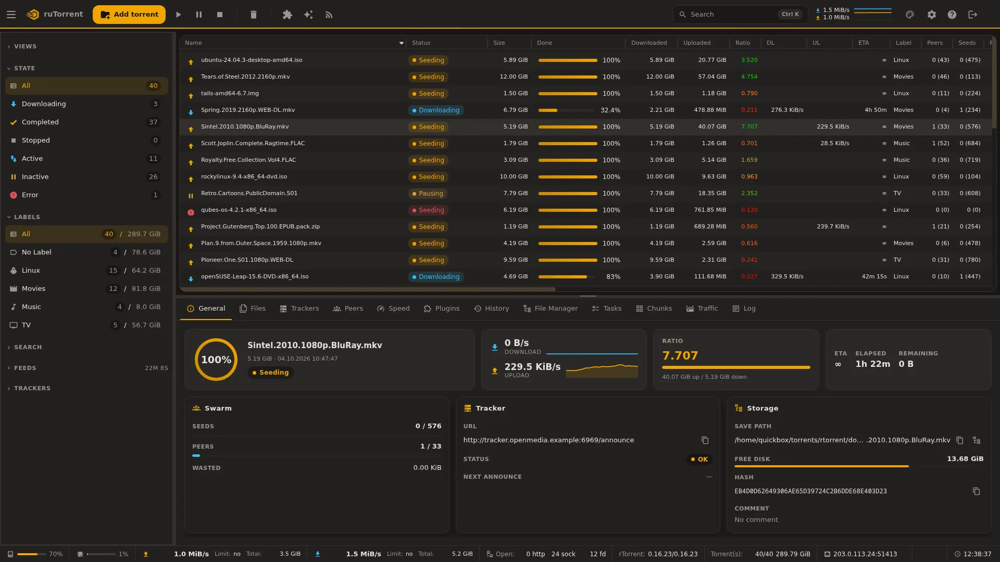 | 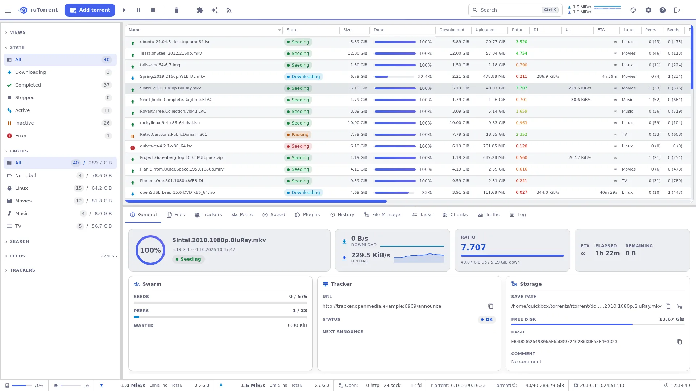 |

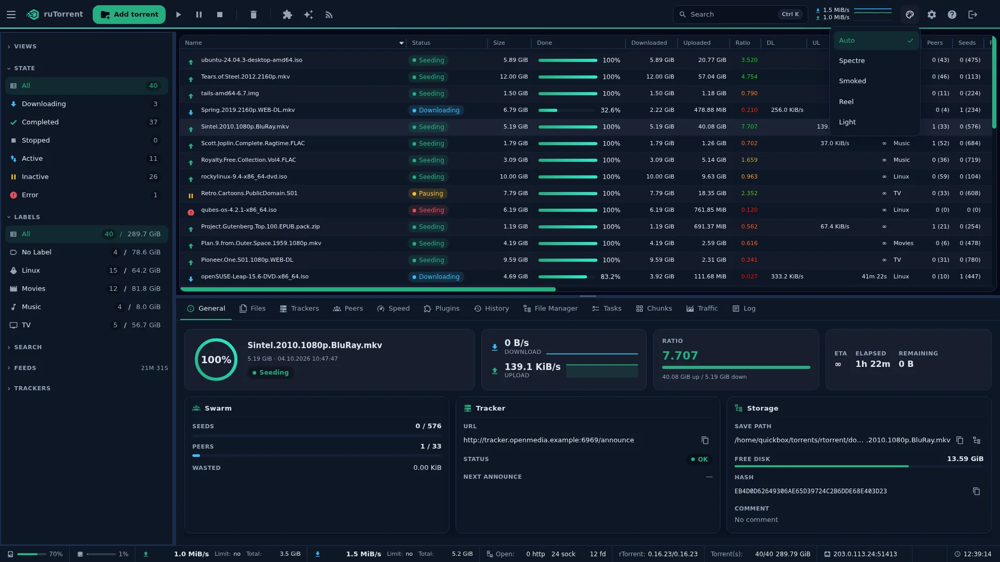

## Highlights

**Smart label icons and an icon picker.** Sidebar labels and trackers carry themed glyphs, and you can assign an icon to a label from a searchable picker.

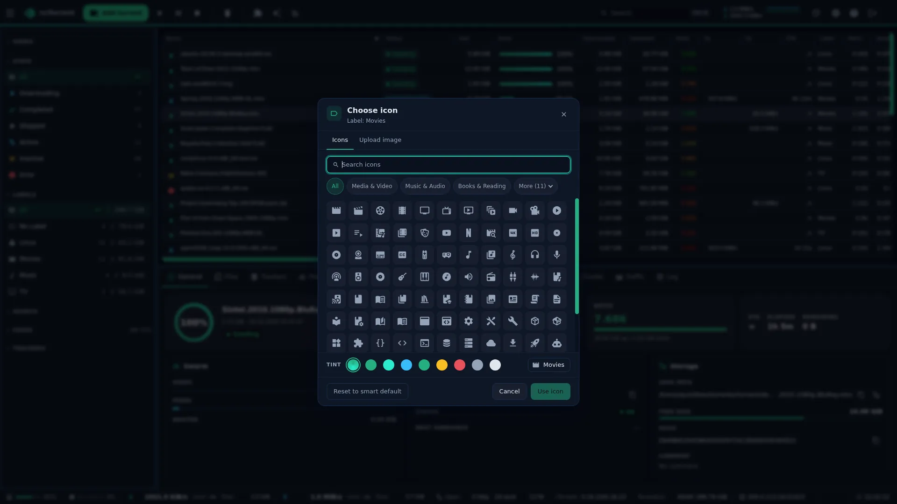

**`Ctrl K` command palette.** Open a command palette to add a torrent, start, pause or stop the selection, jump to Settings, or switch variant, all from the keyboard.

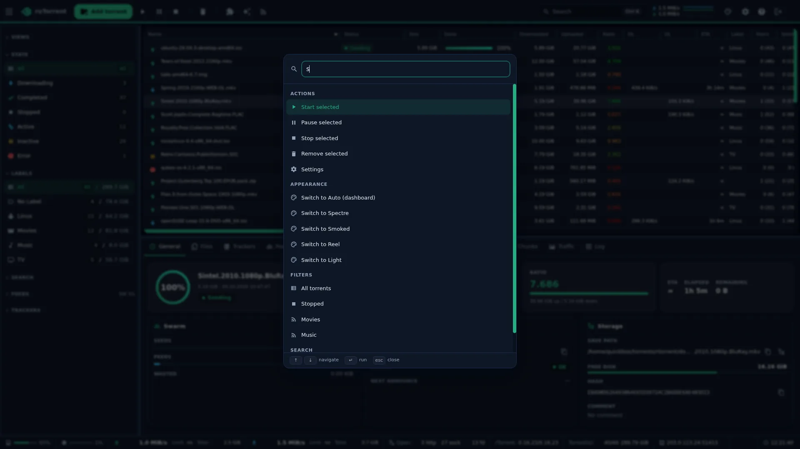

**Drag and drop to add.** Drag `.torrent` files anywhere in the window and drop them onto a full-window overlay, or use the drop-zone card in the Add Torrent dialog.

| Drop zone | Add Torrent |
|-----------|-------------|
| 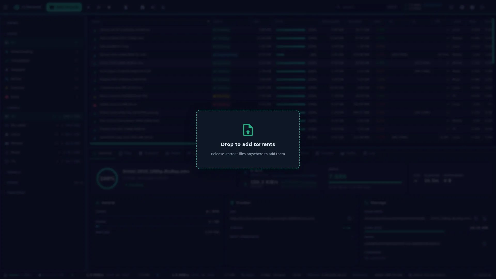 | 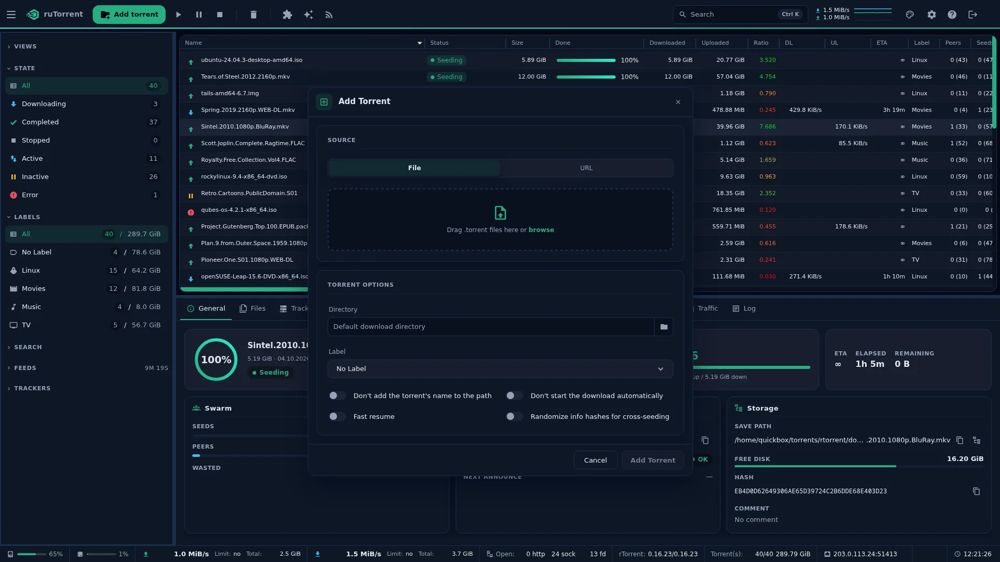 |

**Chunks heatmap.** The Chunks tab draws a canvas heatmap of piece completion with a Downloaded or Seen toggle, so you can see a transfer fill in at a glance.

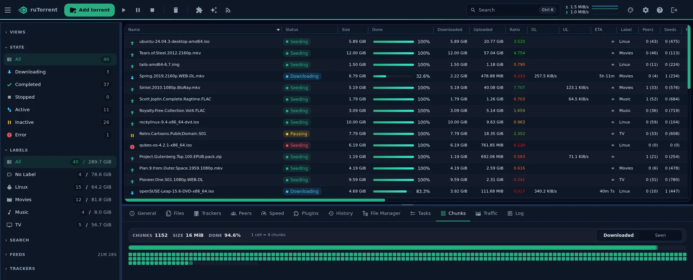

**General overview.** The General tab is a torrent overview, with a completion ring, transfer sparklines, a ratio gauge, and Swarm, Tracker and Storage cards.

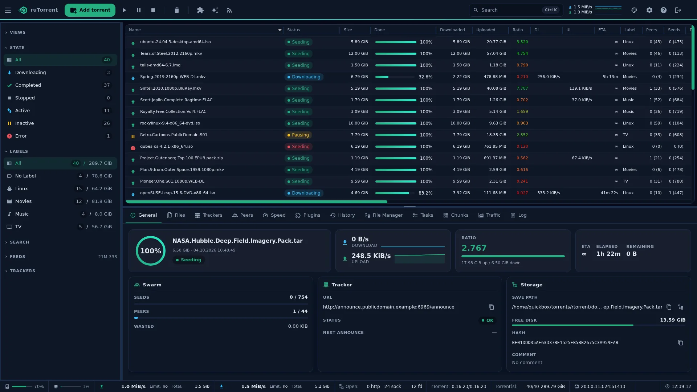

**Reworked Settings, selects and tooltips.** Settings is a grouped, filterable layout in one scroll region. Every native dropdown becomes a themed popover list, and one token-styled tooltip replaces the browser default across the whole skin.

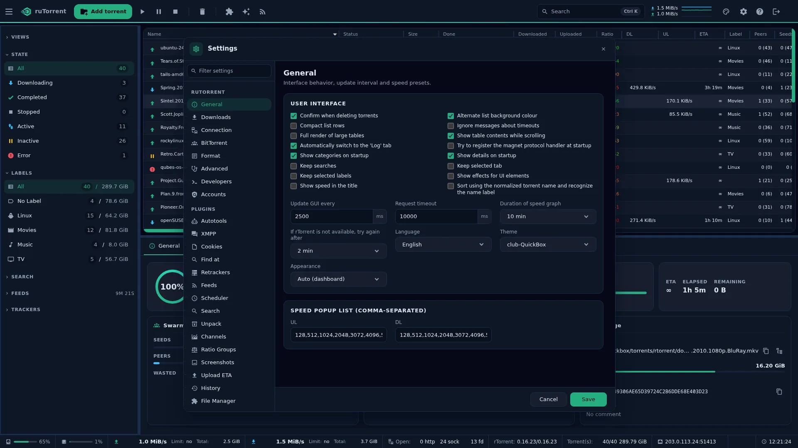

**Media Info reader.** The task console parses Media Info output into readable section cards with a Formatted or Raw switch.

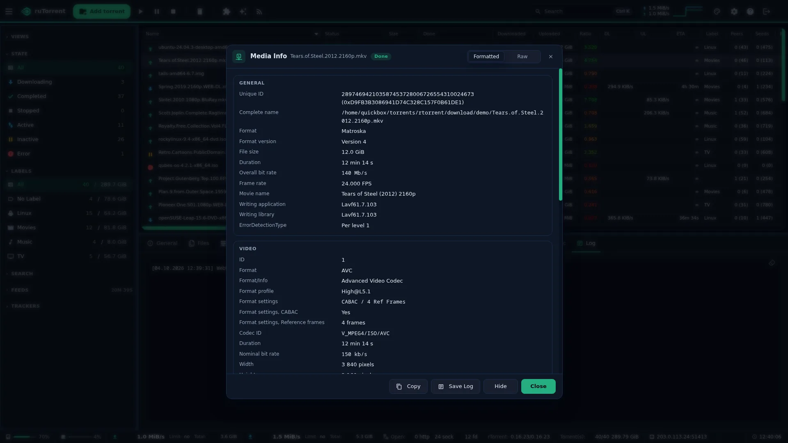

## Install

On a new QuickBox Pro install the theme is installed and set as the default ruTorrent skin automatically, so there is nothing to do.

To install it by hand on any ruTorrent, clone it into ruTorrent's theme directory, usually `plugins/theme/themes`:

```bash
cd /path/to/rutorrent/plugins/theme/themes
git clone -b latest https://github.com/QuickBox/club-QuickBox.git club-QuickBox
chown -R www-data: club-QuickBox
```

Then set club-QuickBox as the active theme in the ruTorrent theme plugin, or in the plugin's `conf.php`, and reload ruTorrent.

## Update

```bash
cd /path/to/rutorrent/plugins/theme/themes/club-QuickBox
git checkout --force latest && git pull
```

On QuickBox Pro an existing install picks up the latest club-QuickBox by updating ruTorrent as an admin, with your admin username: `qb update rutorrent -u <username>`.

## Prefer the v1 look?

The classic club-QuickBox v1 skin is still there if you like it better, and you can switch back any time. On QuickBox Pro, do it as root:

```bash
cd /srv/rutorrent/plugins/theme/themes/club-QuickBox
git fetch origin v1
git checkout v1
chown -R www-data:www-data .
```

Then hard-refresh your browser.

On a manual install, clone with `-b v1` instead of `-b latest` into ruTorrent's `plugins/theme/themes/`.

One thing to know on QuickBox Pro: `qb update rutorrent` checks the theme back out to `latest`, so after a ruTorrent update you are on v2 again and need to repeat the switch.

v1 is frozen now and will not get further updates, because all the new work goes into v2.

## Translations

club-QuickBox ships in English, Danish, German, Spanish, French, Portuguese and Chinese (Simplified), and follows the language you pick in ruTorrent.

Want your language too? See [TRANSLATING.md](TRANSLATING.md) for how to add one and send it in.

## Releases

Versions are derived from the commit history and follow SemVer. A `feat` commit raises the minor version, a `fix`, `perf` or `refactor` raises the patch version, and a `!` marker or a `BREAKING CHANGE` body raises the major version.

Commits must follow the conventional-commits format, because the commit type is what decides the next version.

Every release has a dated note under `changelogs/`, and `CHANGELOG.md` is the aggregate of them all, newest first.

To add a headline paragraph to the next release, write it to `release-notes/next.md`; it is folded into that version's note and removed when the release is cut.

A push to the `latest` branch cuts the release automatically: it computes the version, writes the changelog, tags the commit and publishes the GitHub Release. The release commit is added to `latest` by the automation, so pull `latest` after a release before starting new work.

## Credits

The icon glyphs are from [Material Design Icons](https://pictogrammers.com/library/mdi/), used under the Apache License 2.0. club-QuickBox itself is released into the public domain, so you are free to copy, modify and use it anywhere. See [LICENSE](LICENSE).
